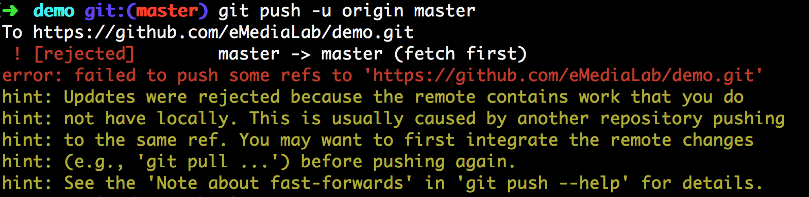
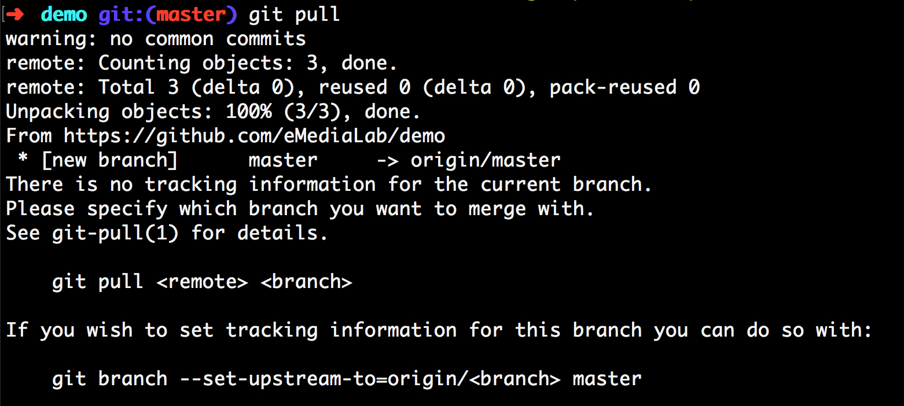

# Working with Git...


### Begin with Customization  
To get the most out of Git, take some time to customize your git config settings. These user preference settings (configuration or "config" files) are stored in multiple locations: 

**Local:** Settings only available to the current project †  
**Global:** Settings apply for any repository for the current user   
**System:** Settings apply to all user accounts

For detailed info on customization, visit [git-scm.com](https://git-scm.com/book/en/v2/Customizing-Git-Git-Configuration).  

**Note** † The "current project" is the repository you are currently pointing to in Terminal: [pwd](https://www.git-tower.com/learn/git/ebook/en/command-line/appendix/command-line-101)

<br>

## How to Customize Settings

**List Configs...**  
These commands will pull up and list in Terminal your current git config settings... 

```
git config --global -l    // Global
git config --local -l     // Local
git config --system -l    // System

```

**Config Locations**  
CD via Terminal to be taken directly to your git config files...

```
~/.gitconfig   // Global
.git/config    // Local
/usr/local/etc  // System

```


**Edit Config**  
Command to quickly edit git config settings...

```
git config --global --edit   // Global
git config --edit            // Local
git config --system --edit   // System

```

**Manual way to Update Specific Config Settings**

```
git config --global user.name "Name Here"
git config --global user.email 

// Change global to system or leave out to set for the current repo
```

**Check Settings**

```
Examples...

git config user.eMail
git config user.name
git remote show origin
git config --get remote.origin.url    // show just the URL
```


**Useful Git Config Settings (Global)**  
Global git settings are a conveninent way to set preferences for all repositories. You can always override a global setting by defining a local git configuration (see above).  

To edit the Global config setting, use this command: `git config --global --edit`

Some helpful Global setting suggestions are listed below... 

```
[core]
editor = code      
autocrlf = false  
safecrlf = false
[credential]
	helper = osxkeychain  
[color]
	ui = auto             
[user]
	name = "Your Name"                 
	email = EmailAddress@someSite.com  

```

Quick Explanation of Global Settings Listed Above...

* **editor:** Set the default text editor to your preferred text editor. The example above sets the editor to Visual Studio Code.
* **autocrlf:** Turns off carriage return line feed injection
* **safecrlf:** Turns off carriage return line feed warnings
* **helper:** Enables storage of repo Username and Password using Mac KeyChain 
* **color:** Use colors with Git in Terminal


**Note:** 
After much research, I found the **autocrlf** and **safecrlf** settings above useful for my specific working situation ( edits being made to the same file on both a Mac and Windows machine ). If you aren't experiencing CRLF errors then you probably don't need to worry about adding these settings. 
  
This article provides helpful background on the difference between Mac and Windows when it comes to editing text, and how that sometimes leads to a headache when using version control: [Mind the End of Your Line](https://adaptivepatchwork.com/2012/03/01/mind-the-end-of-your-line/) 

<br>

# Working with Repositories

### Begin with GitHub...  
If you want to work with an existing repository, the easiest way to begin is to clone the repository of work to your desktop. 

Follow [these steps](https://help.github.com/articles/cloning-a-repository/) to clone a repository to your computer.  

**Note:** Clone with HTTPS **not** SSH 

<br>

## Add Common Files

After downloading a repository, it's a best practice to include the following starter files at the top level (root) of your repository. If these files already exist you may want to customize each to fit the nature of your project.  

* [README.md](https://guides.github.com/features/wikis/) - Write using Markdown Syntax
* [License](https://choosealicense.com/) (if applicable)
* [.gitignore](https://help.github.com/articles/ignoring-files/) †

**Resources:**  
[MacDown:](https://macdown.uranusjr.com/) A helpful application for writing markdown syntax.  
[Mastering Markdown](https://guides.github.com/features/mastering-markdown/): Learn the fundamentals of writing Markdown. 

**Note:** † On a Mac, any file that begins with a dot "." will be invisible. To locate and work with .gitignore files, you can use Terminal. Use the command below to list invisible files in your current project folder. Once you locate or create a .gitignore file, you can then edit this in your favorite text editor...

```
ls -a
open .gitignore 
```
**Power User Trick:** To quickly show invisible files on a Mac...

1. From the [Finder](https://support.apple.com/en-us/HT201732), type `command n` to open a new window
2. Type `command shift .` to show invisible files
3. Type the command again to hide invisible files    


<br>
 

## Begin Work
Once a repository has been cloned to your computer, you can begin to add project work to the folder. If you are working with others or having the work peer reviewed, here are some recommendations...

1. **Commits:** Make regular and _meaningful_ commits
2. **Frequency:** Agree on an expected frequecy of commits 
3. **Workflow:** Consider using a simple "Feature Branch Workflow"

<br>

**Meaningful Commits**  
A meaningful commit explains what change occurs at the point the commit is made. A good practice is to use language that makes this clear. For example...

> Updates README.md to the project

When a visitor reads that commit message, they will immediately know that the commit made a change to the README.md file. If the document is being regularly updated, you may want to give more context on the change, for example...

> Updates README.md to include Table of Contents

This second example adds context and clarity to exactly what changed in the documentation. 

**Frequency of Commits**  
A best practice is to check with your stakeholders regarding the number of commits they expect to see in your repository of work. Here's one way to demonstrate a working session using a consistent frequecy of commits...

* Begin a session with an inline comment. Use the comment to explain your goal for the worksession. 
* Mid-way or at regular timed intervals, stop and make a commit. 
* At the conclusion of your work session, make a final commit.

If you frequently commit and then push your work at the end of your work day, it will become very clear to project stakeholders how much was accomplished.  

**Workflow**  
Using a Feature Branch Workflow can be very helpful when making changes to a repository. This [GitHub Guide](https://guides.github.com/introduction/flow/) can help familiarize you with that concept.  

 <br> 

## Simple Way to Create a New Repo

**Three Steps...**  

1. Visit [GitHub](http://www.github.com) 
1. [Create a new repository](https://help.github.com/articles/create-a-repo/)
1. [Clone to your desktop](https://help.github.com/articles/cloning-a-repository/) ( Use HTTPS protocol, not SSH )  

## Manual way to Create a New Repo  
An alternative to creating the repo on GitHub and cloning down to the desktop, is to create the repo on the desktop and then push to GitHub. 

**The first step:** From the command line type `git init <FolderName>`          

The command above will create and initialize a folder with Git version control tracking enabled (replace brackets and folder name with your own). 

**Note:** "git init" without a folder name will initialize whatever directory you are currently pointing to in Terminal, with version control. Careful with this! If the directory you are pointing to already has version control enabled, the "git init" command will overwrite any previous tracking history!  

```
git add README.md  
git commit -m "first commit"  
git remote add origin https://github.com/accountName/repoName.git  
git push -u origin master

```


## Fetch

### Pull Down and Inspect Changes  
If you want to pull down a remote branch, use Fetch. This will update your local repo with the latest remote activity, but it doesn't merge it to any branch. This is helpful if you are working with others and want to checkout their branches locally. It is also helpful if you are using a [Feature Branch Workflow](https://www.atlassian.com/git/tutorials/comparing-workflows/feature-branch-workflow) for your own work. 


**Fetch: Pull Down Remote Changes**  

```
git fetch  
// Downloads commits, files, and refs (i.e.  branches) but doesn't merge 

```

**Checkout: Inspect Changes**  
After fetching you can inspect any changes made to remote branches.  

```
git branch -r
// List all remote branches that are now available locally to checkout

git checkout origin/dev
// Switches to the remote dev branch (available locally after fetching)
// Replace "dev" to switch to another remote branch
// For example: git checkout origin/someOtherBranchName

```

> **Note:**   
> When you checkout a remote branch, you may see a 'detached HEAD' warning. This isn't anything to be overly concerned about. It simply means... 

> * You are now looking at the remote version of the branch (locally)
> * You are now in a "Read Only" mode 

<br>

## Merge Updates

### Update a Local Repo after Fetching

**Merge: Remote Changes to Local Branch**  
If everything appears ok after fetching, checking out, and inspecting any remote changes (see steps above), ...you can then merge the remote branch to your local copy.  

```
git checkout master
// Checkout the local branch you want to merge into (in this case master)

git merge origin/dev
// Merges the remote dev branch into master 
// Replace "dev" to merge another remote branch to master
// For example: git merge origin/anotherRemoteBranchName

```

<br>

## Working with Remote Repos

**List remote URLs** (if configured)  
To list the remote URL(s) for your repository, cd to the root level of your repo and then type...

```  
git remote -v

```

**Remove a remote**

```
git remote rm <location> <branch> // or simply...  
Example: git remote rm origin

```

**Add a remote** 

```
git remote add <remote alias/name> <url>  
Example: git remote add origin https://github.com/accountName/repoName.git

```

**Note:** When adding a remote, use https **NOT** git@github.com:accountName/repoName.git (SSH)

> **Reasoning:**

> * https is less likely blocked via firewall.
> * Easier setup and works on the widest range of networks/platforms.
> * SSH does not support the credential.helper which will cache your un/pw via https.


**Set Upstream**

```
git push -u origin master

git branch --set-upstream-to=origin/master // This will set the upstream without doing a push first

// After this is set, "git push" is only needed 

// To set the upstream for other branches the process is the same: git push -u origin \<other branch name\>
```

**Force Push**

```
git push -u origin master --force // This will overwrite remote's history, and set upstream
```

**Allow Unrelated Histories**

```
git pull origin branchname --allow-unrelated-histories

git merge origin/master --allow-unrelated-histories // use this if you want to merge a Fetch 

// If your online and local repos have alternate histories, but you know its ok - use this command. 
```

<br>


## Help for Common Issues 


### Unable to Push to Remote
Occasionally you will run into issues when trying to push to a repository. 

```
git remote add origin https://github.com/eMediaLab/repoName.git  
git push -u origin master

```

**ISSUE:**

You may receive an error if you are pushing a local repository for the first time to a repo that already had activity. You may also receive an error if you are pulling a repo for first time to a local repository that already has activity (i.e. a different commit history).

**Solutions:**

1. Don't initialize the online repo with anything (e.g. A ReadMe, .gitignore, etc.) This way, the first push will not try to overwrite any existing history online. The minute you create a ReadMe, .gitignore, etc. online, a history trail begins.
2. Don't begin a local commit history, if the online repo has activity. Similar to the 1st solution, varying version control history will lead to errors. Instead, pull down any online content first - then begin the local commit history.
3. Edge Case: Files were created online, and commit history is also present in local work. Since the online repo and local repository both have varied histories, a push or pull will error. There are a number of ways to merge the two and avoid errors.
  * Use the force (can be dangerous)! 

    git push -u master origin --force 
    
// Using "--force" will overwrite the entire repo online (and set the default upstream)


## Potential GIT Errors

Trying to push without a commit history

**error:** src refspec master does not match any.

**error:** failed to push some refs to 'https://github.com/eMediaLab/someRepoName.git'

**Solution:** Begin a commit history

**Definition:** a "ref" is equivalent to a commit/record/SHA-1 in your history 

Trying to push local commits to a repo that already has a commit history



**Solution:** Fetch and Merge, or pull the remote data and override the error...

### Allow Unrelated Histories

git pull origin branchname --allow-unrelated-histories

git merge origin/master --allow-unrelated-histories 

// use this if you want to merge a Fetch 

// If your online and local repos have alternate histories, but you know its ok - use this command. 

Trying to pull a remote repo for the first time, without the upstream set and with no common commits



**Solution:** See "Allow Unrelated Histories" above... and Set Upstream below!

**Set Upstream**

git push -u origin master

git branch --set-upstream-to=origin/master // This will set the upstream without doing a push first

// After this is set, "git push" is only needed 

// To set the upstream for other branches the process is the same: git push -u origin \<other branch name\>


## Working with Multiple Accounts

Global settings for your username or password do NOT cascade to repos created locally if... 

* osxkeychain helper previously saved your username or password
* You have local config settings for each


**Multiple credentials on GitHub**  
Git may use the osxkeychain helper, which is a CLI (command line) utility that is sometimes installed with Git (i.e. via HomeBrew). This will save your username/password to your Keychain when you successfully login to GitHub the first time in Terminal via HTTPS. After logging in the first time, Git will then use the saved information into the future.

**ISSUE:** You need to Log into under another account, outside of the default/saved keychain credential.

**Solution:** 

1. Update your local repo username and password using git config
2. Erase the saved keychain so Terminal doesn't try to default to that account, or...
3. Reset your credentials using the command(s) outlined below

<br>

**How to Reset stored (cached via osxkeychain) password in Terminal**

``` 
git credential-osxkeychain \<get|store|erase\> 
```

// use get, store, or erase - then specify host, protocol and hit return. 

host=github.com  
protocol=https  
[Press Return]

<br>
